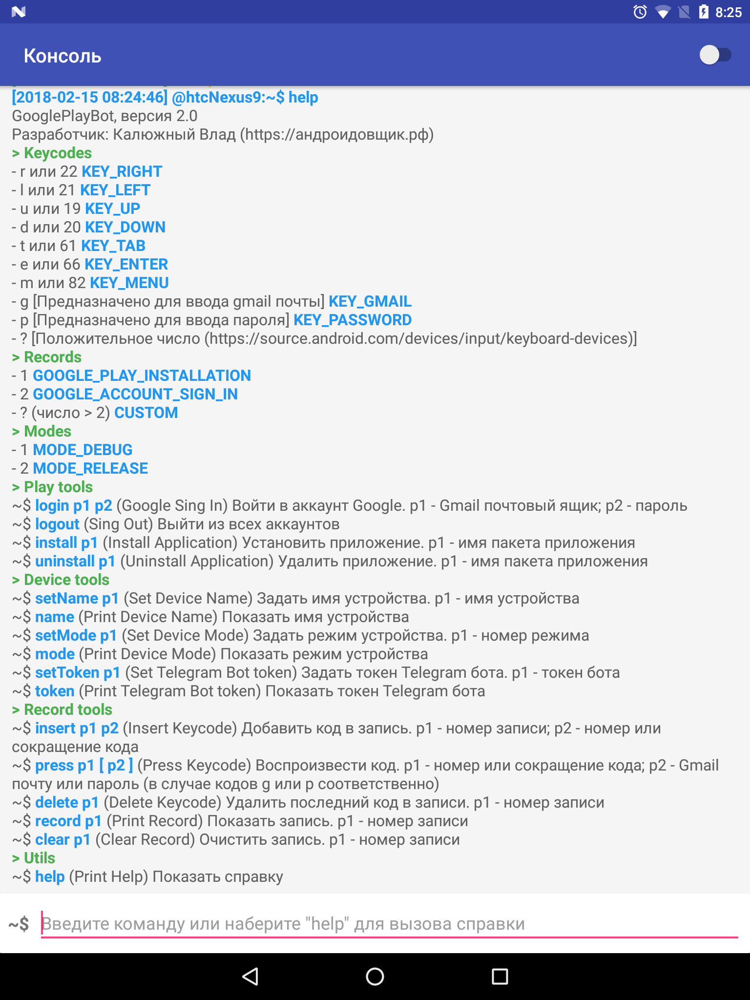

# GooglePlayBot

  

Prototype for android app store optimization by growing downloads. It's not fully functional for today

Article https://habrahabr.ru/post/338934/

All pull requests are welcome.

## Features

* Telegram bot support
* Server API support
* Saving keycodes to SQLite database
* Emulating keycodes on screen
* Other interesting features

[Simple server implementation](https://github.com/androidovshchik/GooglePlayBot/tree/master/simple-server) is also available

## Requirements

Root rights on device

## Binaries

[Download apk here](https://github.com/androidovshchik/CheatASO/releases)

## Screenshots

## License

